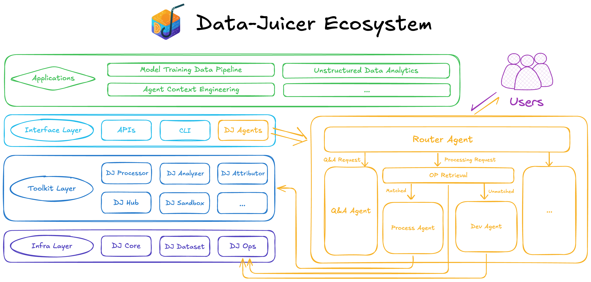

# 📊🤖📊 Data-Juicer Agents

A multi-agent data processing system built on [Data-Juicer (DJ)](https://github.com/datajuicer/data-juicer) and [AgentScope](https://github.com/agentscope-ai/agentscope).

- Data-Juicer Agents (DJ-Agents) is a key component of the interface layer of the Data-Juicer ecosystem, bridging users with the powerful Data-Juicer infrastructure and toolkit for building data-centric applications. 
- Unlike traditional API- or CLI-based interaction mechanisms, DJ-Agents leverage agent-based interaction, tool use, and extensibility to enable non-expert users to access Data-Juicer’s data-processing capabilities through intuitive natural-language interactions.
- The long-term goal of DJ-Agents is to enable a **development-free data science lifecycle**, allowing developers to focus on **what to do** rather than **how to do it**.

## 🎯 Why Data-Juicer Agents?

### Why build a Data Agent on top of Data-Juicer?

Data-Juicer provides a robust foundation for building data-centric agents. With around 200 high-performance operators designed for real-world applications, it supports all major data modalities and enables efficient large-scale processing. Combined with comprehensive tooling and documentation, Data-Juicer offers an ideal infrastructure layer for agents that need reliable, extensible, and production-ready data capabilities.

### Why use Data-Juicer through an agent interface?

Agents offer a natural-language interaction paradigm that significantly enhances usability.
Our goal is to allow users to effortlessly access its capabilities through intuitive instructions. 
Experienced users benefit from faster, more streamlined workflows, while newcomers can leverage Data-Juicer’s full power without learning its API or operator system.

### Who is Data-Juicer Agents for?

If you are:

🙋 A **foundation model researcher/engineer** designing data pipelines and recipes for large-scale model training.  
🙋 A **data scientist/engineer** working with massive amounts of unstructured data for analysis and decision-making.  
🙋 An **agent researcher/engineer** building workflows that retrieve, filter, and structure information from complex environments to create reliable agent context.  
🙋🙋🙋 Anyone who believes in the value of data in your work, research, or daily life.

then **Data-Juicer Agents** is designed for you!

## 📋 Table of Contents

- [📊🤖📊 Data-Juicer Agents](#-data-juicer-agents)
  - [🎯 Why Data-Juicer Agents?](#-why-data-juicer-agents)
    - [Why build a Data Agent on top of Data-Juicer?](#why-build-a-data-agent-on-top-of-data-juicer)
    - [Why use Data-Juicer through an agent interface?](#why-use-data-juicer-through-an-agent-interface)
    - [Who is Data-Juicer Agents for?](#who-is-data-juicer-agents-for)
  - [📋 Table of Contents](#-table-of-contents)
  - [What Does This Agent Do?](#what-does-this-agent-do)
  - [Architecture](#architecture)
    - [Multi-Agent Routing Architecture](#multi-agent-routing-architecture)
    - [Two Integration Modes](#two-integration-modes)
  - [Roadmap](#roadmap)
    - [Data-Juicer Q\&A Agent (Demo Available)](#data-juicer-qa-agent-demo-available)
    - [Interactive Data Analysis and Visualization Agent (In Development)](#interactive-data-analysis-and-visualization-agent-in-development)
    - [Other Directions](#other-directions)
    - [Common Issues](#common-issues)
    - [Optimization Recommendations](#optimization-recommendations)
  - [Related Resources](#related-resources)

## What Does This Agent Do?

DJ-Agents is a series of intelligent agents that can:

- **Intelligent Q&A**: Deliver accurate, comprehensive answers to user questions related to Data-Juicer ecosystem
- **Operator Retrieval**: Automatically match the most suitable operators based on natural language descriptions (precisely locating from ~200 operators)
- **Interactive Data Analysis and Recipe Development**: Collaboratively analyze data and iteratively refine data processing recipes with human feedback
- **Automated Pipeline**: Describe data processing needs, automatically generate Data-Juicer YAML configurations and execute them
- **Custom Extension**: Help users develop custom operators and seamlessly integrate them into local environments

## Architecture

### Multi-Agent Routing Architecture

Data-Juicer Agents adopts a **multi-agent routing architecture**, which is key to system scalability. When a user inputs a natural language request, the **Router Agent** first performs task triage to determine whether it's a standard data processing task or a custom requirement that needs new capabilities.

  

### Two Integration Modes

Agent integration with DataJuicer has two modes to adapt to different usage scenarios:

- **Tool Binding Mode**: Agent calls DataJuicer command-line tools (such as `dj-analyze`, `dj-process`), compatible with existing user habits, low migration cost
- **MCP Binding Mode**: Agent directly calls DataJuicer's MCP (Model Context Protocol) interface, no need to generate intermediate YAML files, directly run operators or data recipes, better performance

These two modes are automatically selected by the Agent based on task complexity and performance requirements, ensuring both flexibility and efficiency.

## Roadmap

The Data-Juicer ecosystem is rapidly expanding. Here are the new agents currently in development or planned:

### Data-Juicer Q&A Agent (Demo Available)

Provides users with detailed answers about Data-Juicer operators, concepts, and best practices.

<video controls width="100%" height="auto" playsinline>
    <source src="https://github.com/user-attachments/assets/a8392691-81cf-4a25-94da-967dcf92c685" type="video/mp4">
    Your browser does not support the video tag.
</video>

The Q&A agent can currently be viewed and tried out [here](https://github.com/datajuicer/data-juicer-agents/blob/main/qa-copilot).

### Interactive Data Analysis and Visualization Agent (In Development)

We are building a more advanced **human-machine collaborative data optimization workflow** that introduces human feedback:
- Users can view statistics, attribution analysis, and visualization results
- Dynamically edit recipes, approve or reject suggestions
- Underpinned by `dj.analyzer` (data analysis), `dj.attributor` (effect attribution), and `dj.sandbox` (experiment management)
- Supports closed-loop optimization based on validation tasks

This interactive recipe can currently be viewed and tried out [here](https://github.com/datajuicer/data-juicer-agents/blob/main/interactive_recipe/README.md).

### Other Directions

- **Data Processing Agent Benchmarking**: Quantify the performance of different Agents in terms of accuracy, efficiency, and robustness
- **Data "Health Check Report" & Data Intelligent Recommendation**: Automatically diagnose data problems and recommend optimization solutions
- **MCP Further Optimization**: Embedded LLM, users can directly use MCP connected to their local environment (e.g., IDE) to get an experience similar to current data processing agents
- **Knowledge Base and RAG-oriented Data Agents**: Agents that leverage Data-Juicer for knowledge base construction, RAG, and related tasks
- **Better Automatic Processing Solution Generation**: Less token usage, more efficient, higher quality processing results
- **Data Workflow Template Reuse and Automatic Tuning**: Based on recipes in Data-Juicer Hub (DJ-Hub)
- ......

### Common Issues

**Q: How to get DashScope API key?**
A: Visit [DashScope official website](https://dashscope.aliyun.com/) to register an account and apply for an API key.

**Q: Why does operator retrieval fail?**
A: Please check network connection and API key configuration, or try switching to vector retrieval mode.

**Q: How to debug custom operators?**
A: Ensure Data-Juicer path is configured correctly and check the example code provided by the code development agent.

**Q: What to do if MCP service connection fails?**
A: Check if the MCP server is running and confirm the URL address in the configuration file is correct.

**Q: Error: requests.exceptions.HTTPError: 400 Client Error: Bad Request for url: http://localhost:3000/trpc/pushMessage**
A: Agents handle data via file references (paths) rather than direct uploads. Please confirm whether any non-text files were submitted.

### Optimization Recommendations

- For large-scale data processing, it is recommended to use DataJuicer's distributed mode
- Set batch size appropriately to balance memory usage and processing speed
- For more advanced data processing features (synthesis, Data-Model Co-Development), please refer to DataJuicer [documentation](https://datajuicer.github.io/data-juicer/en/main/index.html)

---

## Related Resources

- DataJuicer has been used by a large number of Tongyi and Alibaba Cloud internal and external users, and has facilitated many research works. All code is continuously maintained and enhanced.

*Welcome to visit GitHub, Star, Fork, submit Issues, and join the community!*

- **Project Repositories**:
  - [AgentScope](https://github.com/agentscope-ai/agentscope)
  - [Data-Juicer](https://github.com/datajuicer/data-juicer)

**Contributing**: Welcome to submit Issues and Pull Requests to improve AgentScope, Data-Juicer Agents, and Data-Juicer. If you encounter problems during use or have feature suggestions, please feel free to contact us.
