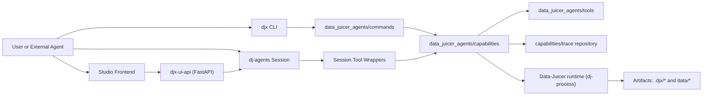

# DJX Overview

`data-juicer-agents` exposes DJX as atomic, composable capabilities for data engineering workflows.

Primary entries:
- `djx`: deterministic CLI command set for planning/execution/dev/trace/evaluate.
- `dj-agents`: natural-language ReAct session orchestrator.
- `djx-ui-api` + `studio/frontend`: local Studio API and web UI.

## Positioning

DJX is a capability layer, not a monolithic all-in-one agent.

Design goals:
- stable command/tool boundaries
- structured I/O and error contracts
- traceable execution and artifacts
- reusable primitives for upper-layer agents/skills

## Architecture

## Module Responsibilities

- `data_juicer_agents/cli.py`
  - Defines `djx` command parser and subcommands.
- `data_juicer_agents/session_cli.py`
  - Defines `dj-agents` session entry (`--ui plain|tui`).
- `data_juicer_agents/commands/`
  - Command adapters for `plan/apply/trace/retrieve/dev/evaluate/templates`.
- `data_juicer_agents/capabilities/`
  - Scenario composition layer:
  - `plan`: plan generation/revision and validation integration.
  - `apply`: `dj-process` execution orchestration.
  - `dev`: custom operator scaffold generation workflow.
  - `session`: ReAct session orchestration and tool exposure.
  - `trace`: run trace persistence/query.
- `data_juicer_agents/tools/`
  - Reusable primitives (dataset probing, operator retrieval/registry, llm gateway, dev scaffold, workflow routing helpers).
- `studio/api/`
  - API-first backend:
  - `routes/` endpoint layer.
  - `services/` orchestration layer.
  - `repositories/` persistence adapters (settings).
  - `managers/` session lifecycle/runtime management.
  - `models/` request/response contracts.
- `studio/frontend/`
  - React UI with tabbed panels: Chat / Recipe / Data / Settings.

## Core Flows

### 1) CLI plan and execution

1. `djx plan` builds a plan (template+LLM patch or full-LLM fallback).
2. `PlanValidator` performs structural/runtime checks (optional LLM review).
3. Plan YAML is written to disk.
4. `djx apply` executes through `dj-process`.
5. `djx trace` inspects run records or aggregated stats.

### 2) Session orchestration

`dj-agents` runs one ReAct agent over atomic tools.
Typical planning chain:

`inspect_dataset -> retrieve_operators -> plan_retrieve_candidates(optional) -> plan_generate -> plan_validate -> plan_save`

`apply_recipe` requires explicit confirmation.

### 3) Studio workflow

- Frontend calls `djx-ui-api`.
- API manages session lifecycle/events, interrupt requests, plan load/save, and data preview/compare.
- Chat view renders assistant messages, reasoning blocks, and tool blocks (args/result).

## Runtime Artifacts

- `.djx/runs.jsonl`: run-level trace records.
- `.djx/recipes/`: generated recipes for execution.
- `.djx/session_plans/`: session-saved plan files.
- `.djx/config.json`: Studio settings profiles.
- `data/`: datasets, plans, and example outputs.

## Scope Notes

- `interactive_recipe/` and `qa-copilot/` are independent subsystems.
- This doc focuses on current DJX surfaces: `djx`, `dj-agents`, `djx-ui-api`, and Studio frontend.
