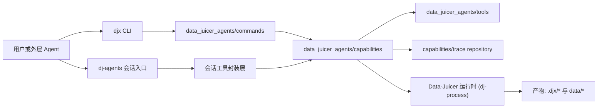

# DJX 架构概览

`data-juicer-agents` 将 DJX 定位为一组面向数据工程场景的可组合原子能力。

主要入口：
- `djx`：确定性 CLI 能力集合（plan/apply/dev/trace/evaluate）。
- `dj-agents`：自然语言会话式 ReAct 编排入口。
- `DJX Studio`（未来项）：API + Web UI 将在后续里程碑发布。

## 项目定位

DJX 是能力层，不是一个“大一统超级 Agent”。

核心目标：
- 稳定的命令/工具边界
- 结构化输入输出与错误协议
- 可追踪的执行过程与产物
- 便于被上层 Agent/skills 复用

## 架构图

## 目录职责

- `data_juicer_agents/cli.py`
  - `djx` 命令解析与子命令注册。
- `data_juicer_agents/session_cli.py`
  - `dj-agents` 会话入口（支持 `--ui plain|tui`）。
- `data_juicer_agents/commands/`
  - `plan/apply/trace/retrieve/dev/evaluate/templates` 命令适配层。
- `data_juicer_agents/capabilities/`
  - 场景能力编排层：
  - `plan`：计划生成/修订与校验接入。
  - `apply`：`dj-process` 执行编排。
  - `dev`：自定义算子脚手架生成流程。
  - `session`：ReAct 会话编排与工具暴露。
  - `trace`：运行记录落盘与查询。
- `data_juicer_agents/tools/`
  - 可复用基础能力（数据探查、算子检索/注册、llm 调用网关、dev 脚手架、workflow 路由辅助）。
- `DJX Studio`（未来范围）
  - API-first 后端与 Web 前端本版本不作为发布范围。

## 核心流程

### 1) CLI 规划与执行

1. `djx plan` 生成 plan（template+LLM 修订，或 full-LLM 兜底）。
2. `PlanValidator` 执行结构/运行前检查（可选 LLM review）。
3. plan 落盘为 YAML。
4. `djx apply` 调用 `dj-process` 执行。
5. `djx trace` 查看单次或聚合统计。

### 2) 会话式编排

`dj-agents` 使用单个 ReAct agent 调用原子工具。
典型 planning 链路：

`inspect_dataset -> retrieve_operators -> plan_retrieve_candidates(可选) -> plan_generate -> plan_validate -> plan_save`

`apply_recipe` 需要显式确认。

### 3) Studio（未来项）

- Studio API/前端能力将延后到后续版本发布。
- 当前版本聚焦 `djx` 与 `dj-agents` 主链路。

## 运行产物

- `.djx/runs.jsonl`：运行 trace。
- `.djx/recipes/`：执行时生成的 recipe。
- `.djx/session_plans/`：会话保存的 plan。
- `.djx/config.json`：本地配置（当前用于 CLI/会话模型配置）。
- `data/`：数据、计划与示例输出。

## 范围说明

- `interactive_recipe/` 与 `qa-copilot/` 为独立子系统。
- 本文档聚焦当前 DJX 主链路：`djx` 与 `dj-agents`。
